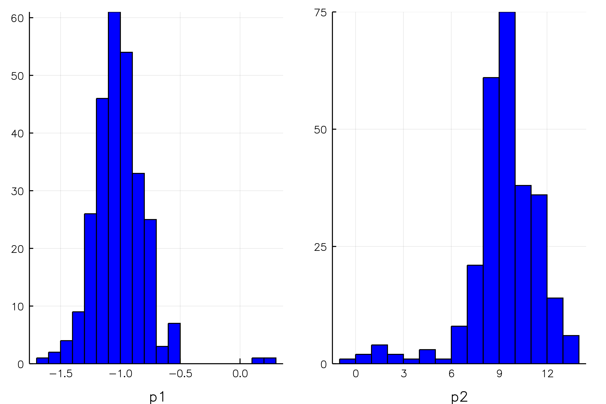
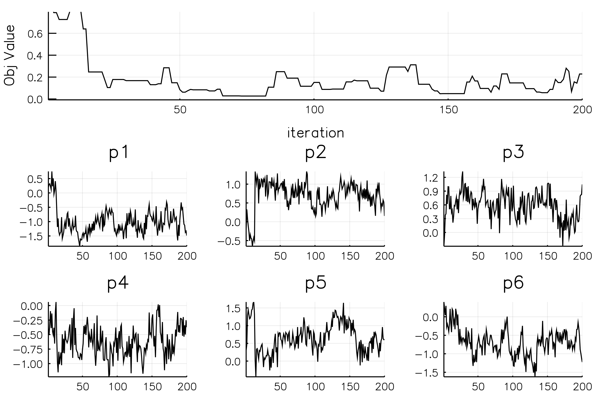
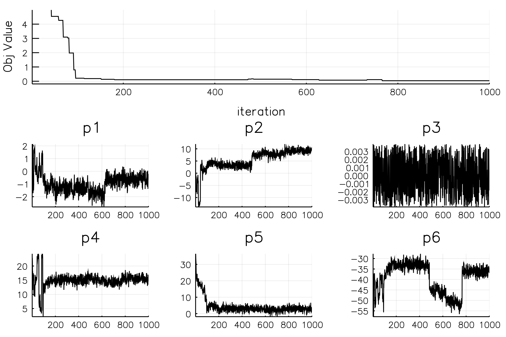
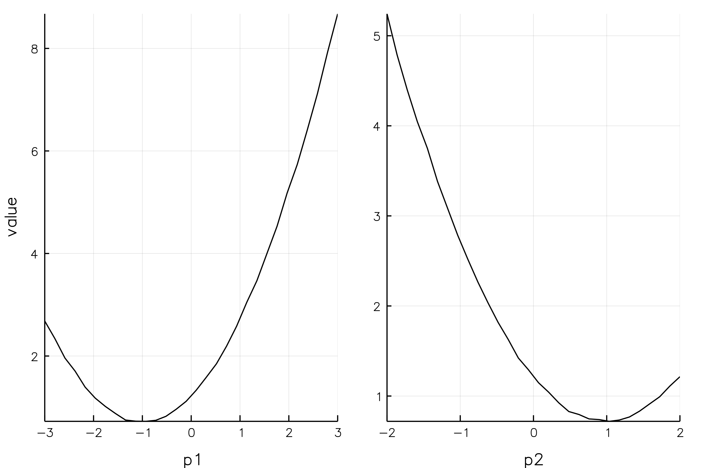

# MomentOpt.jl: Moment Optimization Library for Julia

| **Documentation** | **Build Status**                                                                                |
|:---------------------:|:------------------:|
| [![][docs-stable-img]][docs-stable-url] [![][docs-dev-img]][docs-dev-url] | [![][travis-img]][travis-url] [![][appveyor-img]][appveyor-url] |


This package provides a `Julia` infrastructure for *[Simulated Method of Moments](http://en.wikipedia.org/wiki/Method_of_simulated_moments)* estimation, or other problems where we want to optimize a non-differentiable objective function. The setup is suitable for all kinds of **likelihood-free estimators** - in general, those require evaluating the objective at many regions. The user can supply their own algorithms for generating successive new parameter guesses. We provide a set of MCMC template algorithms. The code can be run in serial or on a cluster.


## Installation

```julia
Pkg.clone("https://github.com/floswald/MomentOpt.jl")
```

## Documentation

[![][docs-stable-img]][docs-stable-url]


## Old documentation

*this has yet to be integrated in to the proper documentation above.*

Let's start slowly. Here we want to estimate the mean parameters of a bivariate normal distribution. The data are generated from mean vector `[-1,1]`, hence, the algorithm should find values `[-1,1]`.


```julia

julia> MomentOpt.snorm_standard()
INFO: These moments are our targets
INFO: Parameter p_i corresponds to moment m_i
2×3 DataFrames.DataFrame
│ Row │ name │ value │ weight │
├─────┼──────┼───────┼────────┤
│ 1   │ mu1  │ -1.0  │ -1.0   │
│ 2   │ mu2  │ 1.0   │ 1.0    │


summary(MA) = 3×5 DataFrames.DataFrame
│ Row │ id │ acc_rate │ perc_exchanged │ exchanged_most_with │ best_val   │
├─────┼────┼──────────┼────────────────┼─────────────────────┼────────────┤
│ 1   │ 1  │ 0.52907  │ 14.5           │ 2                   │ 7.99621e-5 │
│ 2   │ 2  │ 0.721805 │ 34.0           │ 3                   │ 0.00429487 │
│ 3   │ 3  │ 0.712418 │ 23.5           │ 2                   │ 0.0212968  │
```

#### Objective Function and Param History


#### Param Histogram


- [x] Works.

### Example with 2 Parameters on different scales

Now the two moments are an order of magnitude apart. 


```julia
julia> MomentOpt.serialNormal(2,400,save=true)
2×3 DataFrames.DataFrame
│ Row │ name │ value │ weight │
├─────┼──────┼───────┼────────┤
│ 1   │ mu1  │ -1.0  │ 1.0    │
│ 2   │ mu2  │ 10.0  │ 1.0    │

summary(MA) = 3×5 DataFrames.DataFrame
│ Row │ id │ acc_rate │ perc_exchanged │ exchanged_most_with │ best_val    │
├─────┼────┼──────────┼────────────────┼─────────────────────┼─────────────┤
│ 1   │ 1  │ 0.644258 │ 10.75          │ 2                   │ 0.000112698 │
│ 2   │ 2  │ 0.75     │ 29.0           │ 3                   │ 0.00648252  │
│ 3   │ 3  │ 0.832808 │ 20.75          │ 2                   │ 0.0240667   │

```

#### Objective Function and Param History


#### Param Histogram



- [x] Still Works.
- [x] 2 moments one order of magnitude apart.


## Example with 6 parameters on identical scales


```julia
julia> MomentOpt.snorm_standard6()
INFO: These moments are our targets
INFO: Parameter p_i corresponds to moment m_i
6×3 DataFrames.DataFrame
│ Row │ name │ value │ weight │
├─────┼──────┼───────┼────────┤
│ 1   │ mu1  │ -1.0  │ -1.0   │
│ 2   │ mu2  │ 1.0   │ 1.0    │
│ 3   │ mu3  │ 0.5   │ 0.5    │
│ 4   │ mu4  │ -0.5  │ -0.5   │
│ 5   │ mu5  │ 0.7   │ 0.7    │
│ 6   │ mu6  │ -0.7  │ -0.7   │

summary(MA) = 3×5 DataFrames.DataFrame
│ Row │ id │ acc_rate │ perc_exchanged │ exchanged_most_with │ best_val  │
├─────┼────┼──────────┼────────────────┼─────────────────────┼───────────┤
│ 1   │ 1  │ 0.326531 │ 2.0            │ 2                   │ 0.0268808 │
│ 2   │ 2  │ 0.642857 │ 9.0            │ 3                   │ 0.157052  │
│ 3   │ 3  │ 0.702703 │ 7.5            │ 2                   │ 0.834925  │
(


```

#### Objective Function and Param History



#### Param Histogram


- [x] Works with more than 2 moments!

## Example with 6 parameters on different scales

This example is to illustrate that the tuning parameters `acc_tuner`, `maxtemp` and `coverage` are all important. There is no one set of those that will yield a successful estimation: all depends on the location of the moments, the corresponding starting value of each parameter guess and the total number of moments. In those examples, these are randomly generated and often lie very far apart, which creates a particularly challenging setting for a SMM objective function. 


```julia
julia> MomentOpt.serialNormal(6,1000,save=true)
INFO: These moments are our targets
INFO: Parameter p_i corresponds to moment m_i
6×3 DataFrames.DataFrame
│ Row │ name │ value        │ weight       │
├─────┼──────┼──────────────┼──────────────┤
│ 1   │ mu1  │ -1.0         │ 1.0          │
│ 2   │ mu2  │ 10.0         │ 1.0          │
│ 3   │ mu3  │ -0.000511669 │ -0.000511669 │
│ 4   │ mu4  │ 16.8189      │ 16.8189      │
│ 5   │ mu5  │ 2.91133      │ 2.91133      │
│ 6   │ mu6  │ -43.02       │ -43.02       │


summary(MA) = 3×5 DataFrames.DataFrame
│ Row │ id │ acc_rate  │ perc_exchanged │ exchanged_most_with │ best_val  │
├─────┼────┼───────────┼────────────────┼─────────────────────┼───────────┤
│ 1   │ 1  │ 0.0151976 │ 1.3            │ 2                   │ 0.0363635 │
│ 2   │ 2  │ 0.0243902 │ 1.6            │ 1                   │ 0.0982443 │
│ 3   │ 3  │ 0.0242424 │ 1.0            │ 2                   │ 0.237178  │


```

#### Objective Function and Param History



You can see that it takes a while for the algorithm to find the right area. 

- [x] Still works.
- [x] need to run long enough
- [ ] heuristic to choose tuning parameters? NA.


### More Examples

are in `src/Examples.jl`

## Other Features

One produce slices of ones objective function:

**Slices of objective function wrt parameters**  

  

**Slices of moments wrt parameters**  

  
  

**Track BGP proposals by iteration**  

One can allow for the variance of the shock to be changed adaptively. Here this is fixed to obtain a certain acceptance probability. Showing chain number 1, here with fixed variance.


### Example Notebook

Please check out a fully worked example in [`src/example.ipynb`](src/example.ipynb).

## Contributing

We encourage user contributions. Please submit a pull request for any improvements you would like to suggest, or a new algorithm you implemented.

New algorithms:
* You can model your algo on the basis of `src/AlgoBGP.jl` -
* you need to implement the function `computeNextIteration!( algo )` for your `algo`

## Thanks to all Contributors!

* [Julien Pascal](https://github.com/JulienPascal)
* [Edoardo Ciscato](https://github.com/edoardociscato)

[docs-dev-img]: https://img.shields.io/badge/docs-dev-blue.svg
[docs-dev-url]: https://floswald.github.io/MomentOpt.jl/latest

[docs-stable-img]: https://img.shields.io/badge/docs-stable-blue.svg
[docs-stable-url]: https://floswald.github.io/MomentOpt.jl/latest

[travis-img]: https://travis-ci.org/floswald/MomentOpt.jl.svg?branch=master
[travis-url]: https://travis-ci.org/floswald/MomentOpt.jl

[appveyor-img]: https://ci.appveyor.com/api/projects/status/github/floswald/MomentOpt.jl?branch=master&svg=true
[appveyor-url]: https://ci.appveyor.com/project/floswald/MomentOpt.jl/branch/master
